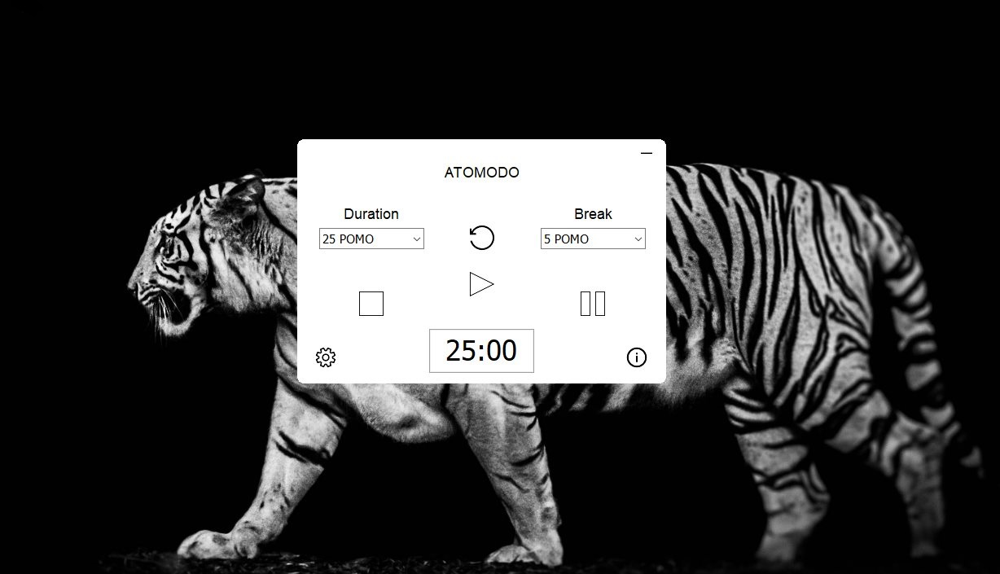

<p align="center">
  
</p>
<h1 align="center">ATOMODO</h1>

ATOMODO (Atomic habits & Pomodoro technique) is an utility that helps you to manage daily tasks by splitting them into small sessions of 25 or 50 minutes with maximum focus (no mail, social network notifications, etc. ). That's is the Pomodoro technique side.

Atomic habits technique is used when we have a habit that we want to develop but we always procrastinate. So in order to accomplish it and cultivate a new competence or a new way of life, we took 2 or 5 minutes per day that we allocate to that task. With the implementation of the habit, we can increase that time progressively. 



## Usage

1. Set the duration of your sessions and breaks
2. Adjust repetitions if you want to do more than one session - ie. x1 (repeat one time) -> 2 sessions
3. Start

## Installation

Binaries for windows are available on the [release](https://github.com/mercibac/atomodo/releases) page.

## Build from source

```git clone github.com/mercibac/atomodo.git```

- Open ```Atomodo.dproj``` in RAD Studio
- Set configuration to Release
- Build the project

### Dependencies

[SVGIconImageList](https://github.com/EtheaDev/SVGIconImageList) and [TLanguage](https://github.com/albertodev01/TLanguages) components are needed in order to compile this project.

## Credits
- Author of Pomodoro Technique book: [Francesco Cirillo](https://www.linkedin.com/in/cirillof/?originalSubdomain=de)
- Author of Atomic Habits book: [James Clear](https://www.wikiwand.com/en/James_Clear)

## TODO
A multi-platform version (Linux, MacOS, Android and iOS) is in development and will be released soon !

Fell free to submit PRs !

## LICENCE

Atomodo is open source and licensed under the [GPLv3](LICENSE) License.
